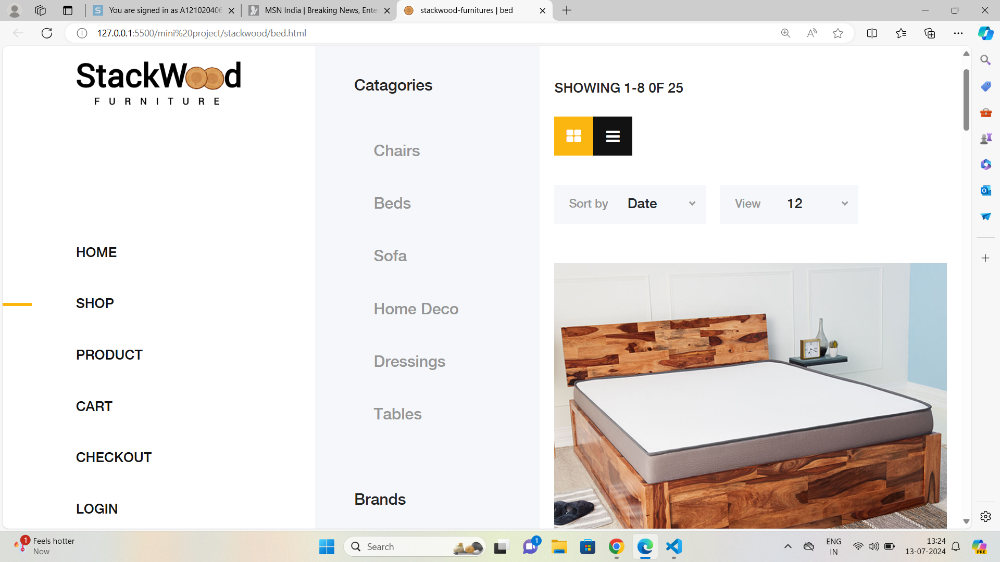
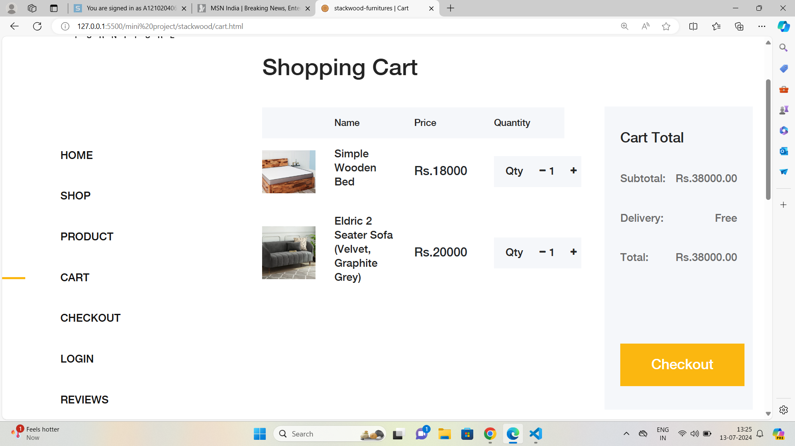
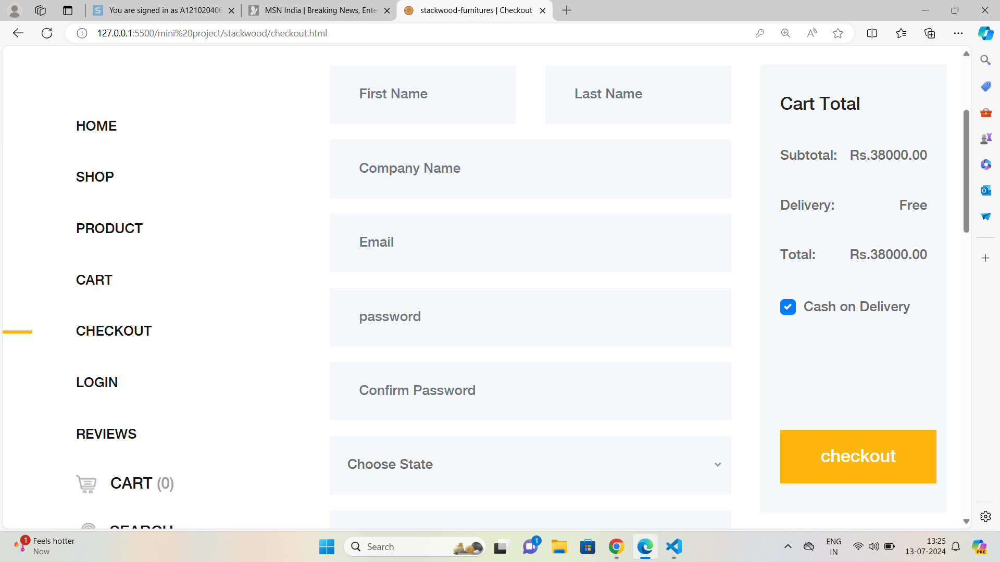

# Ecommerce Website

 Utilized Node.js to build the backend logic and handle server-side operations such as communication between the 
frontend and backend components of the application   
▪ Implemented responsive web design techniques using HTML5 and CSS3 enhancing accessibility and 
usability for users 
▪ Integrated MySQL, a relational database management system, to store and manage the application’s 
data efficiently.

## Screenshots

